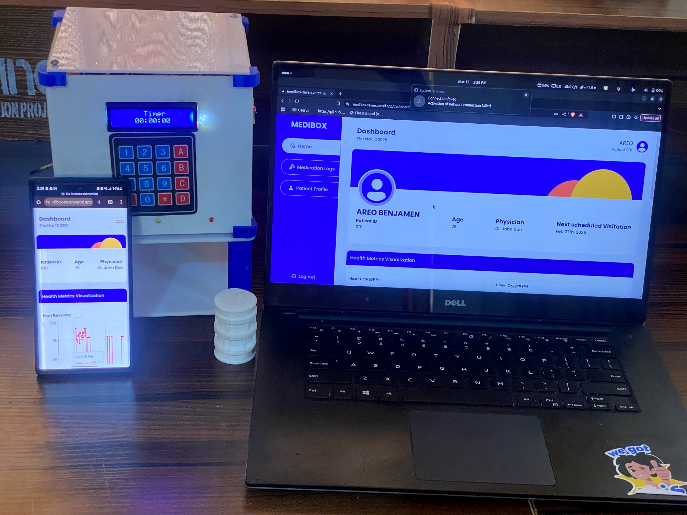

# MEDIBOX 

## Table of Contents

1. [Introduction](#introduction)
2. [Problem Statement](#problem-statement)
3. [System Architecture](#system-architecture)
4. [Hardware Components](#hardware-components)
5. [Software Stack](#software-stack)
6. [Implementation Details](#implementation-details)
7. [Testing and Validation](#testing-and-validation)
8. [Results and Analysis](#results-and-analysis)
9. [Challenges and Limitations](#challenges-and-limitations)
10. [Future Work](#future-work)
11. [Conclusion](#conclusion)
12. [Authors](#authors)

## Introduction

MediBox is an **automated medicine dispensing and health monitoring system** developed as a final-year project in the Department of Electrical and Electronic Engineering, University of Ibadan, Nigeria by [Areo Benjamen](https:linkedin.com/in/areo-benjamen) & [Ajiboye Ajibola](https:linkedin.com/in/areo-benjamen) under the supervision of [Dr. K.O Odeyemi](https:linkedin.com/in/areo-benjamen).

The system is designed to improve medication adherence by alerting users when their medication is due, dispensing the correct dosage, and monitoring key health parameters.

MediBox aims to enhance patient care, particularly for individuals with chronic illnesses or those requiring strict medication schedules.  

## Problem Statement

In contemporary healthcare, medication non-adherence remains a significant challenge, particularly among the elderly and individuals with chronic illnesses. The World Health Organization reports that nearly 50% of patients with chronic diseases do not adhere to their prescribed medication regimens, leading to severe health complications and increased healthcare costs (WHO, 2021). This issue not only jeopardizes patient health outcomes but also strains healthcare systems, with medication non-adherence costing the U.S. healthcare system an estimated $290 billion annually (New England Healthcare Institute, 2009).

## Objectives

The objectives of this project are to:

- design, 3D-print, and laser-cut the models of the physical components of the medicine dispenser which contains medicine containers, tubes, solenoid holders, and other casings;

- interface the mechanical components with the electronic unit (microcontroller & power source) to dispense the medicine containers at scheduled times;

- integrate the health monitoring sensors into the microcontroller; and
- develop a web-based software platform for remote data monitoring and sync with the microcontroller via Wifi.

## System Architecture

Describe the overall architecture, including block diagrams and system flowcharts.

## Hardware Components

Detail the hardware components used, such as sensors, actuators, and microcontrollers.

## Software Stack

Outline the programming languages, frameworks, and tools utilized.

## Implementation Details

Explain the step-by-step process of building the system, including circuit design, firmware development, and integration with the software.

## Testing and Validation

Describe the testing methodology, test cases, and validation processes employed to ensure system reliability.

## Results and Analysis

Present the results obtained from the system's operation, including data analysis and performance metrics.

## Challenges and Limitations

Discuss the challenges faced during development and the limitations of the current system.

## Future Work

Highlight potential improvements and future enhancements for the system.

## Conclusion

Summarize the key findings and achievements of the project.

## Authors

- AREO BENJAMEN
- AJIBOYE AJIBOLA  

## Supervisor  

- Dr. K.O ODEYEMI
